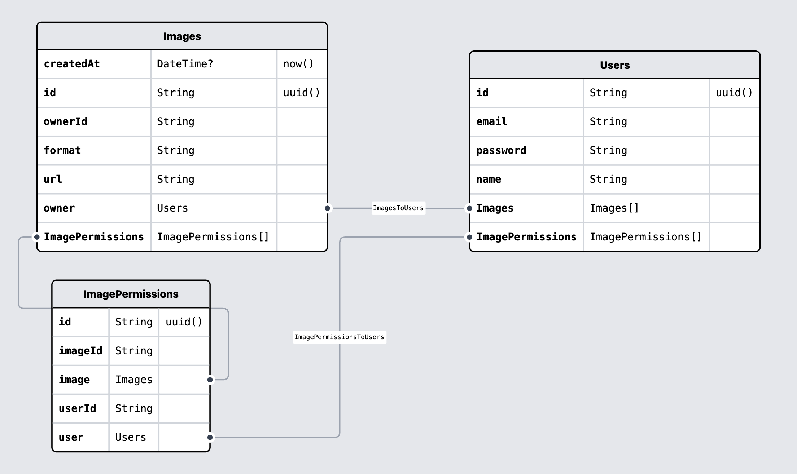

# Arquitectura

El código está distribuido `controllers` y `services`, donde el controller es lo
que recibe el request y el service contiene la lógica de negocio. En caso de
haber sido un servidor más grande la capa de acceso de datos podría estar
separada también. Me gusta mucho el patrón repositorio. Con respecto a la infra:

- Bucket S3 público para fácil acceso, en caso de necesitar guardar información
  más confidencial (documentos de usuarios) crearía uno nuevo con permisos más
  limitados. Tuve que configurar policies para que sea público.
- Base de datos también en amazon (RDB), con un usuario específico creado en
  IAM.
- Autenticación pensé usar congnito pero decidir simplificar la implementación
  realización el hashing + salt de las contraseñas localmente

El sistema de permisos está basado en el modelo ABAC (Attribute Based Access
Control), donde por cada combinación de usuario y recurso (en este caso
imágenes) creó una entrada en la tabla `ImagesPermissions` registrando el
permiso. Ahí mismo podría definir otras acciones, ahora los usuarios con
imágenes compartidas solo puede ver el archivo

# Diagrama DB

# Correr el proyecto

- Pegar archivo `.env`
- Correr `pnpm i`
- En una terminal correr `npm run build`
- En otra terminal correr `npm run serve`

El servidor por defecto va a correr en el puerto 3000, todos los endpoints estan
en
[este](https://www.postman.com/crmappteam/workspace/prex-challenge/collection/2540637-b9b3be13-e3af-4556-949a-bb0f4b56f707?action=share&creator=2540637&active-environment=2540637-cf5e26db-e664-4904-b5ab-c75cb4cc451d)
workspace de postman

# Tests

No llegue a incluir los tests porque no quería demorar más tiempo en la entrega,
pero pensé en los siguientes casos de uso:

## Autenticacion

- Login usuario que no existe / credenciales incorrectas (error)
- Login usuario credenciales correctas
- Registro usuario mail en uso (error)
- Registro usuario mail nuevo
- Subir una imagen
- Bajar una imagen que sea tuya
- Bajar una imagen que no sea tuya y no tengas permisos (error)
- Bajar una imagen que no sea tuya y tengas permisos
- Dar permisos a un usuario para ver una imagen
- Dar permisos a uno mismo con una imagen propia (error)
- Sacar permisos
